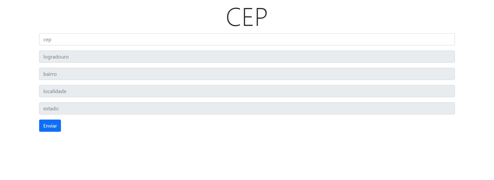

<h1> BUSCADOR DE ENDEREÇO </h1>

    Projeto de API que busca o endereço (estado, rua, bairro e cidade) através do cep informado pelo usuário. 

<h2>Tecnologias usadas:</h2>

* HTML
* CSS
* jQuery
* Ajax

